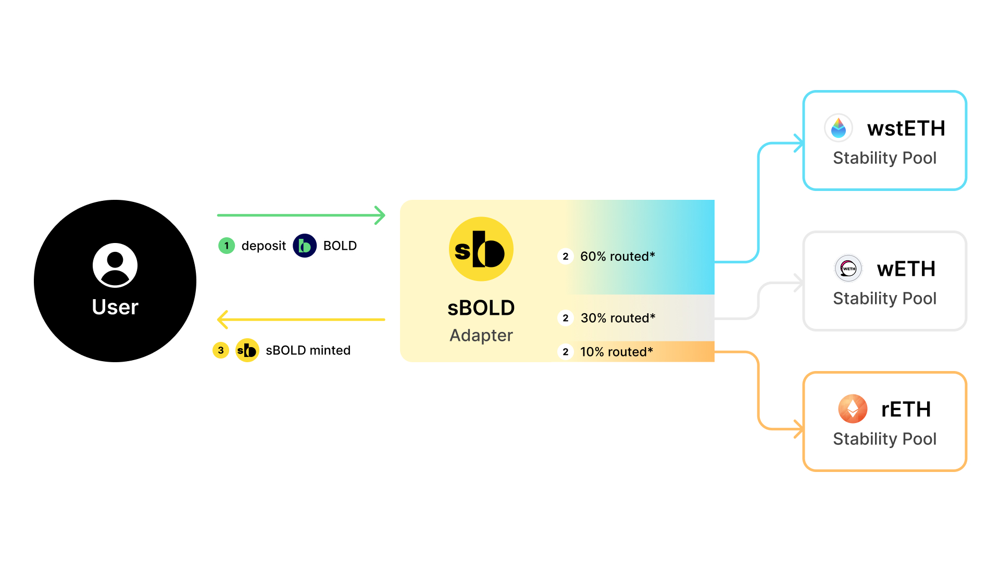

# Introducing sBOLD

<figure><figcaption></figcaption></figure>

**sBOLD** is a yield-bearing tokenized representation of a deposit into Liquity’s v2 Stability Pools based on a weights set on deployment. The protocol will initially accept BOLD deposits and route them into the wstETH, wETH and rETH stability pools in fixed proportions (60%, 30% and 10%, respectively). In return, the depositor receives an ERC4626 token that could be integrated with third-party protocols like money markets, decentralized exchanges and yield trading platforms for improved capital efficiency.

sBOLD possesses a rebalancing feature, by which the weights and the Stability Pools can be changed and the funds are provided with the new ratios to the respective Stability Pools set. The operation is only permitted to be executed by the vault administrator and only if the collateral left in the contract is less than maximum collateral in BOLD previously set.

<figure><figcaption>
sBOLD: Flow of Funds
</figcaption></figure>

## The yield-bearing component of sBOLD stems from two streams:

First, it captures the pro-rata distributions of the interest rate paid by the borrowers to the Stability Pools. A hodler of 1 sBOLD receives the equivalent of the interest paid to 60 cents deposited into the wstETH Stability Pool plus 30 cents deposited into the wETH Stability Pool and 10 cents into the rETH Stability Pool.

[K3 Capital](https://www.k3.capital/) will act as a active manager, changing the weights on a biweekly basis to optimize the expected yield for the sBOLD holders based on TVL, running interest rates and exposure.

Second, the sBOLD holders capture the liquidation penalty with minimum collateral price exposure. Theoretically, Stability Pool depositors acquire liquidated collateral at a discount. However, the penalty is not realized until the collateral is sold for the underlying asset, BOLD. sBOLD automates the process on behalf of the users by incentivising *solvers* triggering withdrawal and swap transactions of accumulated collaterals, effectively realizing the penalty as quickly as possible. The architecture does not only remove the price exposure to Stability Pool depositors, but also facilitates better third-party integrations due to the lack of multiple underlying assets backing sBOLD.
