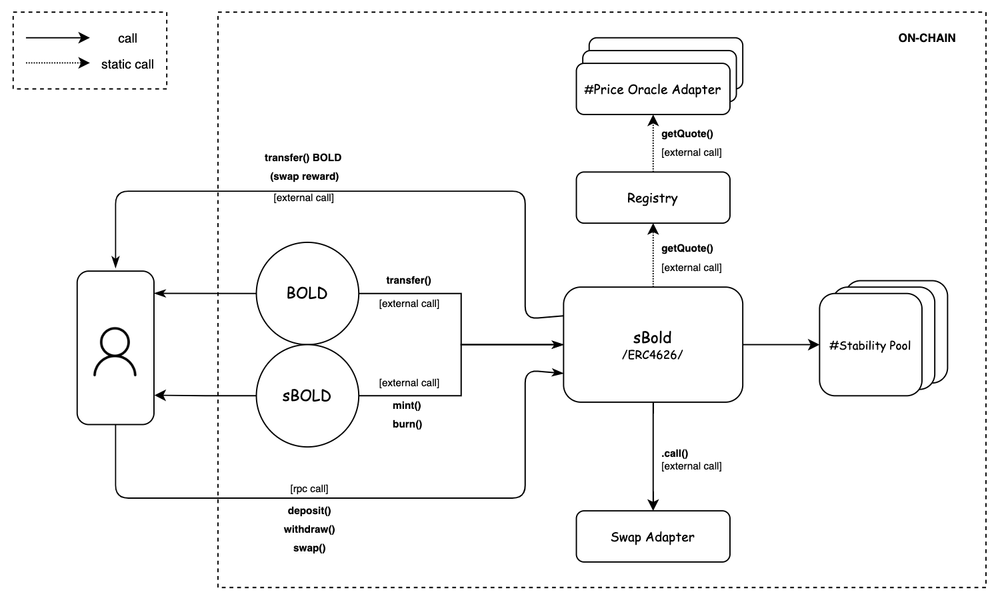

# Technical Details

The architecture of sBOLD Protocol is built around the prevalent and industry-compatible ERC4626 standard, which serves as the entry-point between external accounts and the core underlying mechanisms.

sBOLD provides a capital-efficient way for liquidity provision across multiple stability pools, part of the new Liquity v2 protocol infrastructure. Each connected stability pool is provided BOLD, based on pre-configured weights in basis points.

## Overview

<figure><figcaption></figcaption></figure>

### **ERC-20**

The underlying asset is the ERC-20 token, in the face of the BOLD token that will be held by the vault.

### **sBOLD**

sBOLD is the primary entry-point contract and implements the logic that is common to all vaults, such as tracking, validating the boundaries for positions, previewing deposit and withdrawal quantities, and applying fees.

The primary component also includes extra logic for the communication with the stability pools connected, and swapping the accumulated collateral gains to the primary BOLD token.

For code organization purposes, some of its logic is delegated to static (non-upgradeable) modules.

### **Price Oracle**

PriceOracle components interface with external pricing systems to calculate the quote for the BOLD and collateral tokens in USD in real time.

### **Swap Adapter**

SwapAdapter contract represents an external or internal contract call to which a data for swap is delegated to execute a transaction in which the sBOLD contract should receive a minimum quantity of BOLD in exchange for accumulated collateral from liquidations based on the real time quotes received.

### Accounting

sBOLD contract is standard-conforming ERC-4626 vault with additional functionality to integrate aggregation of the tokens in the stability pools owned by the accounts and effectively swapping the collateral tokens to the primary BOLD token. The vault accounts only one type of token: the vault's underlying asset (simply called asset in the code) and calculates in real time the quote for collateral across each pool in BOLD. Because ERC-4626 is a superset of ERC-20, vaults are also tokens, called vault shares or sBOLD. These shares represent a proportional claim on the vault's assets, and are exchangeable for larger quantities of the underlying asset over time as interest is accrued in BOLD within the Stability Pools and collateral discount is realized from the automated liquidation and rebalancing process. As recommended by ERC-4626, shares have the same number of decimals as their underlying asset's token.

### **Exchange Rate**

The exchange rate in the sBOLD protocol is calculated as a product of the division between the total value in BOLD, held by the contract in each stability pool, with accumulated interest added with denominations to the primary BOLD token, and the total supply of sBOLD vault shares.

$$
sBold_{rate} = \frac{BOLD}{\sum sBOLD}
$$

As such, assuming no bad debt from unsuccessful liquidations, sBOLD will act as a compounding token similar to wstETH.

The denomination of the accumulated collateral to BOLD is calculated based on the minimum, which will be received after the swap, with a reward and fee deducted from the received quantity.

$$
\sum B_{C_{min}}=\left[\sum C \times(1-\sigma)\right]\times(1-p_r-p_f)
$$

$$
\text{where:}
\left\{
\begin{array}{l}
0 \leq p_r \leq 0.10 \\
0 \leq p_f \leq 0.10 \\
\end{array}
\right\}
$$

where:

* C = Collateral from each stability pools denominated in primary asset (BOLD);
* σ = Maximum slippage in basis points;
* p\_r = Reward portion in basis points;
* p\_f = Swap fee portion in basis points.

Upon calculating the cumulative minimum quantity of BOLD to be obtained subsequent to a collateral exchange, the total value in BOLD can be computed in the following manner:

$$
B_0=BOLD+\sum B_{C_{min}}
$$

A subsequent deduction from the total value is applied by removing the maximum allowed collateral value, which can be held by the contract, and effectively the one which should be swapped, before limiting the deposit and withdrawal. This limit should exist in the vault to create a net delta positive for the caller of the swap and effectively incentivise third party actors to rebalance and should be subtracted from the total amount in BOLD in order for the vault to account only realised gains.

$$
B_1=B_0-B_{CU_{max}}
$$

where:

* B\_0 = Total BOLD amount owned by the contract;
* B\_CUmax = Maximum unrealised collateral (accumulated collateral gains) value (can be set up to 7,500 upper boundary in BOLD).

#### **Rounding**

The quantity of assets that can be redeemed for a given number of shares is always rounded down, and the number of shares required to withdraw a given quantity of assets is rounded up. This ensures that depositors cannot withdraw more than they have deposited plus interest and liquidation premium accrued. These two behaviours ensure that all impact of rounding happens in favour of the vault and of disadvantage of the depositor in order to ensure solvency of the system.

#### **Fee Switch**

sBOLD may apply an entry fee on deposit and respective mint transactions. The entry fee is a configurable parameter and initially set to 0, but can be increased up to specific quantity stored in basis points and is transferred to a fee receiver configured in the sBOLD contract.

If introduced, on deposit the fee is deducted from the quantity of the assets supplied to Liquity v2’s Stability Pools, resulting in minting fewer shares, compared to the mechanism on mint, where the exact requested quantity is minted.

The fee is calculated in the previewDeposit and the previewMint functions but is not accounted for in case the sBOLD’s total supply is equal to zero.
