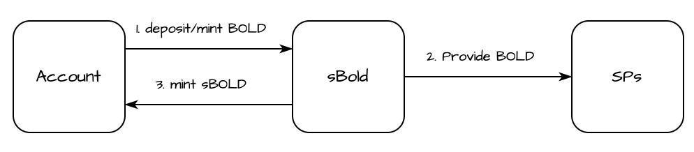
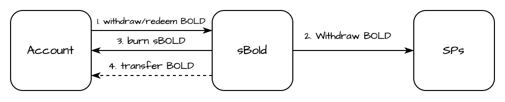
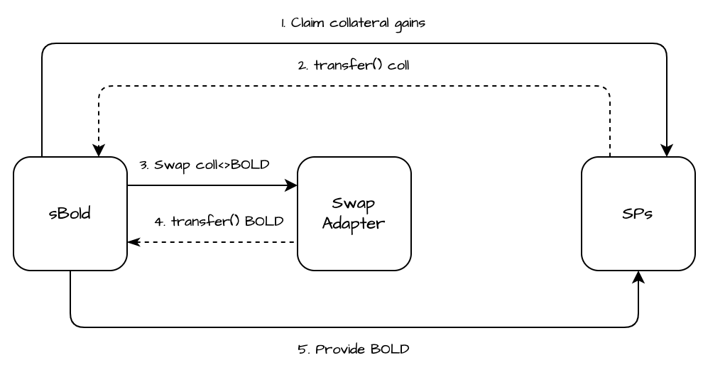

# Interactions

sBOLD protocol as a standard-conforming ERC4626 vault implements the fundamental deposit, mint, withdraw, and redeem functionalities. These main methods operate around the product of the exchange rate specification, simply summarized, the rate is calculated based on the total BOLD holdings and the total supply of sBOLD.

The deposit and withdrawal operations are only enabled in a condition where the total collateral value denominated to BOLD is at maximum equal to the configured limit in the contract storage (simply called BC\_U\_max, from the B1 formula). This upper boundary ensures protection against DoS, where malicious accounts can transfer small quantities and effectively block operations.

Before executing any core operation the protocol checks the current exposure to accumulated collateral assets. This check ensures the system remains within defined operational limits, especially following periods of high liquidation activity.

The protocol calculates the total value of collateral accumulated and expresses this value in both USD and BOLD. If the collateral exposure exceeds a predefined threshold, it indicates that a significant share of the protocol’s assets has been generated into collateral assets. While this does not imply insolvency, it reflects an imbalanced asset composition.

In such cases, the protocol temporarily restricts the deposit and withdraw operations to avoid increasing exposure further and to maintain healthy system dynamics. This mechanism helps protect liquidity and ensure the protocol remains stable and responsive during volatile market conditions.

### **Deposit**

The Stability Pool (each simply called SP) liquidity provision in BOLD is executed through the deposit and mint functions. Deposit and mint functions apply an entry fee, which deducts a fraction from the desired deposit quantity or adds a fraction of the cost of the share on mint.

On the first deposit, the contract mints a constant amount of shares, and a constant amount of assets is transferred to limit the possibility of an inflation attack. An entry fee is not applied on the first deposit, performed on deployment of the contract.

<figure><figcaption></figcaption></figure>

sBOLD calculates the quantities to provide to each operational SP based on the configured weights in the contract storage.

$$
a_{SP_i} = a_0 \times {w_i} \quad \text{for} \ i = 1, 2, \dots, n
$$

### **Withdraw**

The sBOLD withdrawal operations share the same compatible behaviour as deposit and mint. Accounts can withdraw assets and burn the corresponding sBOLD shares based on internally calculated BOLD/sBOLD exchange rate.

<figure><figcaption></figcaption></figure>

On withdrawal and redeem, accounts withdraw assets from the operational Stability Pools, based on the share’s portion over the total supply in the sBOLD protocol. That way, a fair quantity of primary assets are distributed to the account and burnt in share units.

$$
a_i = \frac{s}{\sum {s}} \times SP_i \quad \text{for} \ i = 1, 2, \dots, n
$$

### Swap

sBOLD introduces a mechanism for collateral aggregation across each internally operational  Stability Pool on Liquity v2, which claims the accumulated liquidated collateral and swaps it for BOLD with a low boundary, based on slippage tolerance configuration. After the swaps are successfully executed, the contract deposits the swapped amount of BOLD with the same preset weights to each of the connected stability pools.

<figure><figcaption></figcaption></figure>

The swap can be triggered by any account that can provide call data, which could be effective enough to result in an amount of primary assets equal to or more than the minimum calculated. The swaps can be partial and for a single collateral to ensure the system's flexibility, meaning that an account can swap only fractions of the collateral amount for one or more pools in case of insufficient market liquidity.

The swap fee receiver is rewarded a return in basis points, configured by the admin with a restriction for minimum value. The calculated quantity is based on the total received BOLD quantity from each swap. sBOLD’s swap can also apply a fee, calculated in the same way as the reward, which has an initial value of 0 and a maximum value restriction and is transferred to the preconfigured fee receiver address.

sBOLD will onboard only trusted adapters, which are industry standard or internally owned and resilient strategies. Initially, sBOLD will rely on the battle-tested 1inch v6 router to aggregate the best liquidity options. In this configuration, the swap caller should input a route call received from the [1inch API](https://portal.1inch.dev/documentation/overview).

### Rebalance

The sBold Protocol offers the flexibility to adjust existing Stability Pools or establish new weight allocations. There should be a minimum of one and a maximum of five configured pools, collectively representing 100% in basis points. The process of rebalancing can be performed only by the administrator, and it unfolds over four stages:

1. **Swap**

The underlying collateral, generated from the Stability Pools is swapped to BOLD. In case of insufficient swap, where the collateral left in the protocol is more than B\_CUmax, the execution reverts.

2. **Withdraw**

The total amount provided in each Stability Pool is withdrawn and sent to the sBOLD contract.

3. **Reconfiguration**

The existing Stability Pools are decommissioned and the new ones are established with their respective weight allocations.

4. **Provide**

The final stage involves the allocation of the total BOLD holdings to the newly established Stability Pools. This distribution is carried out in accordance with the configuration defined in the third step.
